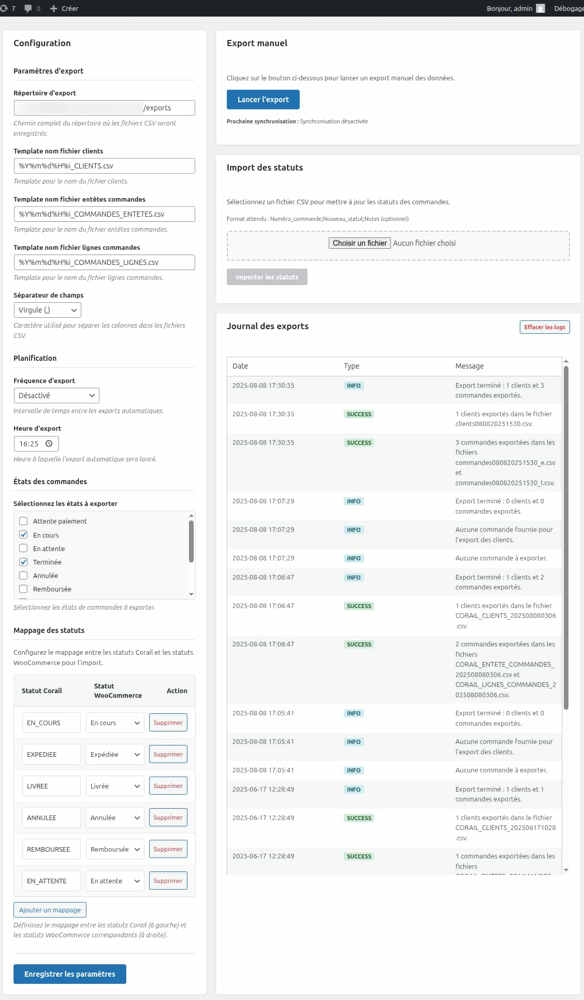

# Plugin Wordpress "Connecteur Corail"

- Nom du plugin : **Connecteur Corail**
- Développé par : [Answeb](https://www.answeb.net)
- Version : 1.0.0
- Requis : WordPress 6.8.1 ou supérieur, WooCommerce 9.8.5 ou supérieur, PHP8 ou supérieur

## Description

Ce plugin Wordpress, conçu pour être utilisé avec Woocommerce, permet :

- d'exporter au format CSV les données des clients et des commandes vers un dossier local
- de lire un fichier permettant de mettre à jour le statut des commandes

Il est suffisamment configurable pour couvrir les besoins de l'ERP Corail.

## Installation

### Installation manuelle (développement)

1. Télécharger ou cloner le plugin dans `/wp-content/plugins/`
2. Exécuter `composer install` dans le répertoire du plugin
3. Se connecter à l'administration WordPress
4. Aller dans **Extensions > Extensions installées**
5. Localiser "Connecteur Corail" et cliquer sur **Activer**
6. Accéder aux réglages via **WooCommerce > Connecteur Corail**

### Installation via fichier ZIP

1. Télécharger le fichier `.zip` depuis les releases GitHub
2. Se connecter à l'administration WordPress
3. Aller dans **Extensions > Ajouter une extension**
4. Cliquer sur **Téléverser une extension**
5. Sélectionner le fichier `.zip` et cliquer sur **Installer maintenant**
6. Cliquer sur **Activer l'extension**
7. Accéder aux réglages via **WooCommerce > Connecteur Corail**

### Installation via le répertoire WordPress (si publié)

1. Se connecter à l'administration WordPress
2. Aller dans **Extensions > Ajouter une extension**
3. Rechercher "Connecteur Corail"
4. Cliquer sur **Installer maintenant** puis **Activer**
5. Accéder aux réglages via **WooCommerce > Connecteur Corail**

## Capture d'écran

### Configuration du plugin

Le plugin est configurable via l'interface d'administration de WordPress. Il permet de définir les paramètres suivants :

- **Répertoire d'export** : Chemin du répertoire local où les fichiers CSV seront enregistrés.
- **Templates de noms de fichiers** : Templates personnalisables pour nommer les fichiers exportés :
  - Template fichier clients : Format du nom pour le fichier d'export des clients
  - Template fichier entêtes commandes : Format du nom pour le fichier d'export des entêtes de commandes
  - Template fichier lignes commandes : Format du nom pour le fichier d'export des lignes de commandes
- **Séparateur de colonnes** : Caractère utilisé pour séparer les colonnes dans les fichiers CSV (par défaut, le
  point-virgule `;`) : Virgule, point-virgule, tabulation
- **Fréquence d'export** : Intervalle de temps entre les exports automatiques (par exemple, quotidien, hebdomadaire)
  ainsi que l'heure de l'export.
- **Etat des commandes** : Filtre multiple pour exporter uniquement les commandes ayant l'un de ces états (par
  exemple, "terminée", "payée", etc.) parmi les états disponibles dans Woocommerce.

### Fonctionnalités

Le plugin s'enregistre dans WordPress et ajoute une page de configuration dans le menu d'administration (Sous menu
Woocommerce).
La page permet de configurer le plugin, et également de lancer manuellement l'export des données.
Une zone de journalisation affiche les messages d'erreur lors de l'export (et le nombre de lignes clients et commandes
exportées).

#### Commandes

L'export des commandes ajoutera dans la zone des messages de la commande une note indiquant que la commande a été
epxortée. Il ajoutera également une meta donnée indiquant que la commande a été exportée. Cette meta donnée sera
affichée dans la liste des commandes et pourra être réinitialisée dans le détail de la commande.

#### Clients

L'export des clients est déclenché automatiquement lors de l'export des commandes et ne concerne que les clients ayant
au moins une commande exportée. Les clients sans commande ne sont pas exportés.

L'export des clients ajoutera dans la liste des clients de woocommerce une colonne indiquant que le client a été
exporté. Cette meta donnée sera également affichée dans le détail du client et pourra être réinitialisée.

### Spécifications des exports

Les fichiers sont au format CSV et sont exportés dans un répertoire local spécifié dans les paramètres du plugin. Le
séparateur de colonnes est paramétrable (par défaut ";"). 

### Nommage des fichiers

Le nom des fichiers est entièrement personnalisable grâce à des templates configurables pour chaque type de fichier :

- **Fichier clients** : Template personnalisable (par défaut : `%Y%m%d%H%i_CLIENTS.csv`)
- **Fichier entêtes commandes** : Template personnalisable (par défaut : `%Y%m%d%H%i_COMMANDES_ENTETES.csv`)
- **Fichier lignes commandes** : Template personnalisable (par défaut : `%Y%m%d%H%i_COMMANDES_LIGNES.csv`)

#### Variables de template disponibles :

- `%Y` : Année sur 4 chiffres (ex: 2025)
- `%y` : Année sur 2 chiffres (ex: 25)
- `%m` : Mois avec zéros (01-12)
- `%d` : Jour avec zéros (01-31)
- `%H` : Heure 24h avec zéros (00-23)
- `%i` : Minutes avec zéros (00-59)
- `%s` : Secondes avec zéros (00-59)
- `%n` : Mois sans zéros (1-12)
- `%j` : Jour sans zéros (1-31)
- `%G` : Heure sans zéros (0-23)
- `%l` : Nom complet du jour (Lundi, Mardi, etc.)
- `%F` : Nom complet du mois (Janvier, Février, etc.)
- `%M` : Nom abrégé du mois (Jan, Fév, etc.)
- `%D` : Nom abrégé du jour (Lun, Mar, etc.)

#### Exemples de templates :

- `CORAIL_%d%m%Y_%H%i_clients.csv` → `CORAIL_08082025_1530_clients.csv`
- `Export_%Y-%m-%d_%H%i%s.csv` → `Export_2025-08-08_153045.csv`
- `CMD_%l_%F.csv` → `CMD_Vendredi_Août.csv`

#### Clients

Liste des champs exportés pour les clients :

- Identifiant client (<=20 caracts). Utiliser l'ID de l'utilisateur WordPress correspondant.
- Prenom (<=30 caracts)
- Nom (<=30 caracts)
- Raison Sociale (<=60 caracts)
- Adresse1 (<=60 caracts)
- CP (<=10 caracts)
- Adresse2 (<=60 caracts)
- Ville (<=60 caracts)
- Pays (<=60 caracts)
- Telephone1 (<=20 caracts)
- Email (<=100 caracts)

NB: Si les champs sont vides, ils seront laissés vides dans le fichier CSV. Les données sont extraites du profil client
WooCommerce (WC_Customer) pour les clients enregistrés, ou des informations de facturation de la commande pour les
clients invités.

#### Commandes

Les commandes sont exportées dans deux fichiers séparés :

##### Fichier Entête Commandes

Liste des champs exportés pour l'entête des commandes :

- Date Commande (format AAAA-MM-JJ)
- Num Commande
- Identifiant Client Facturé (<=20 caracts). Utiliser l'ID de l'utilisateur WordPress correspondant.
- Montant Frais Port
- Prenom Livraison (<=30 caracts)
- Nom Livraison (<=30 caracts)
- Adresse1 Livraison (<=60 caracts)
- Adresse2 Livraison (<=60 caracts)
- CP Livraison (<=10 caracts)
- Ville Livraison (<=60 caracts)
- Prenom Facturation (<=30 caracts)
- Nom Facturation (<=30 caracts)
- Adresse1 Facturation (<=60 caracts)
- Adresse2 Facturation (<=60 caracts)
- CP Facturation (<=10 caracts)
- Ville Facturation (<=60 caracts)
- Designation Remise
- Montant Remise

##### Fichier Ligne Commandes

Liste des champs exportés pour les lignes de commandes :

- Num Commande
- Identifiant Produit (<=20 caracts). Utiliser l'UGS du produit dans Woocommerce.
- Qte (Quantité vendue)
- PU (Prix unitaire en HT ou en TTC suivant le type de client professionnel ou particulier)
- Pourcentage Remise (% remise à la ligne) => Toujours à 0 car woocommerce ne gère pas les remises à la ligne.

NB: Pour les ventes aux particuliers les prix reçus doivent être TTC et pour les clients professionnels en HT. Les
données sont extraites directement des commandes WooCommerce (adresses de livraison et de facturation).

## License

> This program is free software; you can redistribute it and/or modify it under the terms of the GNU General Public
> License, version 3, as published by the Free Software Foundation.
> 
> This program is distributed in the hope that it will be useful, but WITHOUT ANY WARRANTY; without even the implied
> warranty of MERCHANTABILITY or FITNESS FOR A PARTICULAR PURPOSE. See the GNU General Public License for more details.
> 
> You should have received a copy of the GNU General Public License along with this program; if not, write to the Free
> Software Foundation, Inc., 51 Franklin St, Fifth Floor, Boston, MA 02110-1301 USA

A copy of the license is included in the root of the plugin’s directory. The file is named `LICENSE`.

## Crédits

### Answeb - Développement du plugin

Ce plugin a été développé par [Answeb](https://www.answeb.net), agence spécialisée dans le développement web et les
solutions e-commerce. Answeb accompagne les entreprises dans leur transformation digitale en créant des solutions
sur-mesure adaptées à leurs besoins spécifiques.

**Expertise Answeb :**

- Développement WordPress & WooCommerce, Prestashop
- Intégrations ERP et solutions métier
- Connecteurs et API personnalisés
- Solutions e-commerce avancées

Pour toute question technique ou demande d'évolution du plugin, vous pouvez contacter l'équipe Answeb via notre
site web.

### ICS Coop - ERP Corail

Corail est un ERP dévelopép par la société [ICS Coop](https://ics-coop.fr/corail/). C'est une solution complète de
Gestion Commerciale destinées aux caves coopératives, domaines et châteaux, négociants et courtiers pour la gestion de :
commandes, facturation, préparation, logistique, entrepôt, EDI, traçabilité…

### Documentation, FAQs, and More

If you’re interested in writing any documentation or creating tutorials please let me know .